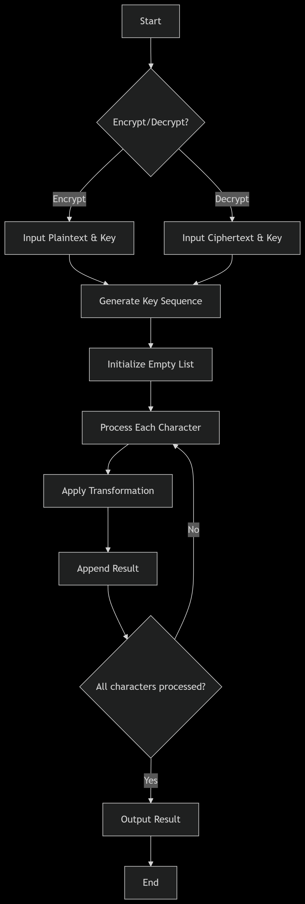

<p align="center">
  
</p>

<h2 align="center"><strong>Hajee Mohammad Danesh Science and Technology University</strong></h2>

<h3 align="center">Dinajpur-5200</h3>

---

# TwistCipher - A Novel Symmetric Encryption Algorithm

### Course Information
- **Course Title:** Mathematical Analysis for Computer Science  
- **Course Code:** CSE 361  


### Participant Information
- **Submitted By:** Abdur Razzak  
- **Student ID:** 2102042  
- **Submitted To:** Pankaj Bhowmik (Lecturer)  

---

## 🔍 Overview
**TwistCipher** is an educational symmetric key encryption algorithm that demonstrates fundamental cryptographic concepts. It combines character position, ASCII values, and a user-defined key to perform encryption and decryption operations.

---

---

## ✨ Key Features
- **Symmetric Key:** Uses same key for encryption and decryption
- **Position-Aware:** Incorporates character position in transformation
- **ASCII-Based:** Works with standard character encoding
- **Deterministic:** Produces consistent results for same inputs
- **Educational Focus:** Designed for learning purposes

--- 

## 🧮 Core Algorithm

### Mathematical Foundation
For each character at position `i`:
Encryption: `(P[i] + K[i] + i) mod 256`
Decryption: `(C[i] - K[i] - i) mod 256`

Where:
- `P[i]` = ASCII value of plaintext character
- `K[i]` = ASCII value of key character
- `C[i]` = ASCII value of ciphertext character
- `i` = character position index (0-based)

---

## 📊 Algorithm Specifications

### 🔐 Encryption Process
**Input:** Plaintext string, Key string  
**Output:** Ciphertext string  

1. Initialize empty cipher list
2. Generate key sequence by repeating key to match plaintext length
3. For each character in plaintext:
   - Calculate: `(ord(char) + ord(key_char) + position) % 256`
   - Convert result to character
   - Append to cipher list
4. Join cipher list into final string

### 🔓 Decryption Process
**Input:** Ciphertext string, Key string  
**Output:** Plaintext string  

1. Initialize empty plaintext list
2. Generate key sequence by repeating key to match ciphertext length
3. For each character in ciphertext:
   - Calculate: `(ord(char) - ord(key_char) - position) % 256`
   - Convert result to character
   - Append to plaintext list
4. Join plaintext list into final string

---

## 💻 Implementation

```python
def encrypt_twistcipher(plaintext, key):
    cipher = []
    key_sequence = (key * ((len(plaintext) // len(key)) + 1))[:len(plaintext)]
    
    for i in range(len(plaintext)):
        encrypted_char = (ord(plaintext[i]) + ord(key_sequence[i]) + i) % 256
        cipher.append(chr(encrypted_char))
    
    return ''.join(cipher)

def decrypt_twistcipher(ciphertext, key):
    plaintext = []
    key_sequence = (key * ((len(ciphertext) // len(key)) + 1))[:len(ciphertext)]
    
    for i in range(len(ciphertext)):
        decrypted_char = (ord(ciphertext[i]) - ord(key_sequence[i]) - i) % 256
        plaintext.append(chr(decrypted_char))
    
    return ''.join(plaintext)

```
------
## Experimental Validation
Test Case
python
message = "HelloWorld!"
secret_key = "MyKey"

# Encryption
cipher = encrypt_twistcipher(message, secret_key)
print("Encrypted:", cipher)  # Output: Õëõû‰Ùõÿö’Ü

# Decryption
original = decrypt_twistcipher(cipher, secret_key)
print("Decrypted:", original)  # Output: HelloWorld!

## Verification
The test case confirms successful round-trip encryption and decryption, validating the algorithm's correctness.

# Flow Chart 
<p align="center">
  
</p>
